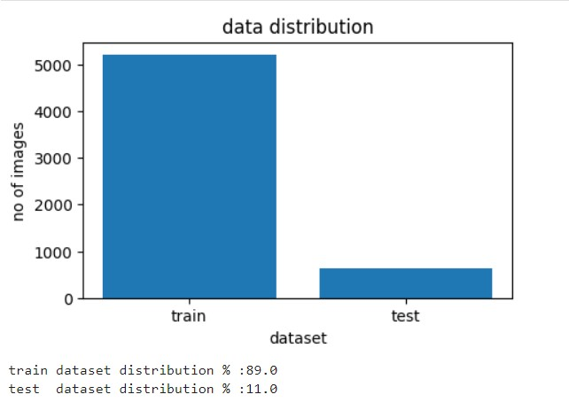

# Pneumonia detection using deep learning

## Table of Contents
- [Project Overview](#project-overview)
- [Data Sources](#data-sources)
- [Tools and Frameworklib](#tools-and-frameworklib)
- [EDA](#exploratory-data-analysis)
- [Data preprocessing](#datapreprocessing)
- [Performance metrics](#performance-metrics)
- [Loss function](#loss-function)
- [Choosing a Model](#choosing-a-model)
- [Training the Model](#training-the-model)
- [Making Predictions](#making-predictions)
- [Deployee model](#deployee-model)
- [Recommendations](#recommendations)

## Project Overview
Pneumonia is an infection in lungs caused by bacteria, viruses or fungi. It's a significant public health issue that often requires timely and accurate diagnosis for effective treatment. This project aims to develop a deep learning model, specifically using Convolutional Neural Networks (CNN), to automatically detect pneumonia from chest X-ray images. The proposed model focuses on efficiently identifying pneumonia, assisting healthcare professionals in diagnosis.

## Data Sources
   Chest X-ray Images from [kaggle](https://www.kaggle.com/datasets/paultimothymooney/chest-xray-pneumonia)

## Tools and Frameworklib

  Programming Language   : Python
  
  Deep Learning Framework: TensorFlow and Keras,Scikit-learn,Matplotlib
  
  Dataset                : Chest X-ray dataset
  
  Tools                  : Jupyter Notebook / Pycharm

## Exploratory Data Analysis

  

## Data preprocessing
1. **Resizing images**    : Since the dataset contains x-ray images of different dimensions to make it consistent, I converted the dimensions to a standard size (64 X 64) which improves train the model will be faster.
2. **Normalization**      : Scaling pixel values b/w 0 to 1 to make training faster and efficient.
3. **Data Augumentation** : Apply transformations like rotation, flipping and zooming etc artificially which increase the dataset size to avoid model overfitting.
4. **Reused transfer**    : learning models [ which is alredy trained by large dataset ] to reduce training time and compare the results.

**limitation** :
 It's a huge dataset. Due to limitations of my GPU (RTX 4060Ti 16GB, 128-bit) and time constraints, I could not run algorithms at higher epochs.
 
## Performance metrics
accuracy_score

## Loss function
binary crossentropy

## Choosing a model

**Unbalanced datase**t : 90% vs 10% - **validation accuracy 62%**

I will fit below all models and choose best fit model.

Note : GPU configuration - RTX 4060Ti 16GB with 4352 cuda cores

Model                    | Train accuracy  | Test accuracy |   Train loss  | Test/Validation loss |  epochs |    Hyperparameters                      |
------------------------ | -------------   | ------------- | ------------- |  -------------       | --------|  -----------------------------          | 
VGG16 pretrain           |   0.75          |   0.62        |   0.56        |    0.69              |   20    |   optimizer = adam,learning_rate=0.0001 |
Resnet50                 |   0.74          |   0.62        |   0.57        |    0.69              |   20    |   optimizer = adam,learning_rate=0.0001 |
MobileNet                |   0.99          |   0.62        |   0.001       |    157               |   20    |   optimizer = adam,learning_rate=0.0001 |
ResNet50V2               |   0.97          |   0.62        |   0.06        |    5.03              |   20    |   optimizer = adam,learning_rate=0.0001 |
Custom CNN VGG16         |   0.74          |   0.62        |   0.57        |    0.69              |   20    |   optimizer = adam,learning_rate=0.0001 |

**Balanced datase**t : 60% vs 40% - **validation accuracy 91%**  
Due to data unbalance we notice most of our models are overfit ( custom VGG16). To avoid overfit problem we apply tunning on 

1. Balance data distribution
2. Reduce the no of layers and no of nuerons
3. Applied l2 regularizer
4. Earily stoping feature

Model                    | Train accuracy  | Test accuracy |   Train loss  | Test/Validation loss |  epochs |    Hyperparameters                             |
------------------------ | -------------   | ------------- | ------------- |  -------------       | --------|  -----------------------------                 | 
Custom CNN VGG16         |   0.88          |   0.91        |   0.29        |    0.42              |   20    |   optimizer = adam  learning_rate=0.0001 no of layers:8 no of nuerons:48 l2 regularizer (0.01)|   

## Training the model
[**ML model code**](Pneumonia_Detection.ipynb)

## Making Predictions 
Performed optimization and resolve overfitting probelm which improve accuracy 91%. 
 
[**Optimal model code**](OptimizedModel.ipynb)
 

## Deployee model
- deployeed into local machine using fastapi tested model
- [**app.py**](deploye/app.py)  
- [**download model**](deploye/pneumonia.h5)
- Testing using FastAPI swagger UI http://127.0.0.1:8000/docs  
- 

## Recommendations
Using this model improves the effectiveness of CNNs for detecting pneumonia in chest X-rays, supporting clinical diagnosis with high accuracy (91%).

Note : The deep learning model's performance is evaluated by accuracy and other metrics. Further optimizations and tuning may lead to better results.

